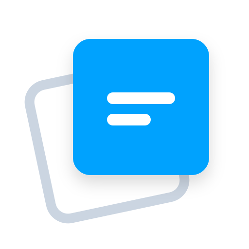

<div align="center">
  
  <h1>FloatBoard</h1>
  <p>A beautifully designed, always-on-top clipboard manager for your daily productivity.</p>

  <!-- Badges -->
  <a href="https://github.com/nazihyazan/floating_board/releases"></a>
  <a href="https://floatboard.xyz"></a>
</div>

<br/>

## 📖 Overview
FloatBoard is a cross-platform desktop application that lives above your other windows. It keeps your clipboard history accessible at all times without interrupting your workflow. Built with a stunning glassmorphism design, it seamlessly blends into your operating system.

<div align="center">
  <!-- PUT YOUR MAIN SCREENSHOT LINK HERE -->
  
</div>

## ✨ Features
- **Always On Top:** Never lose track of your clipboard. FloatBoard floats gracefully above your active applications.
- **Glassmorphism UI:** A sleek, semi-transparent interface that adapts to your desktop background.
- **Hover to Focus:** Work faster without extra clicks. The board automatically focuses when you hover over it.
- **Cross-Platform:** Available for Windows, macOS, and Linux.
- **Smart History:** Automatically saves your copied text and allows instant one-click copying back to your OS clipboard.
- **Light & Dark Mode:** Adapts to your environment dynamically.

### 💎 Premium Features
Unlock the full potential of FloatBoard with a [Premium License](https://floatboard.xyz):
- **🎨 Premium Themes:** Unlock exclusive color palettes (Catppuccin, Dracula, Rosé Pine, and Monochrome).
- **📹 Media Support:** Save and preview images and videos directly in your clipboard history.
- **📌 Multi-Window Pinned Cards:** Tear off specific notes and pin them anywhere on your screen.

<div align="center">
  <!-- PUT YOUR THEMES SCREENSHOT LINK HERE -->
  
</div>

## 🚀 Installation

### Windows
Download the latest `.exe` or AppX package from the [Releases page](https://github.com/nazihyazan/floating_board/releases).

### macOS
Download the `.dmg` file from the [Releases page](https://github.com/nazihyazan/floating_board/releases). Supports both Apple Silicon and Intel.

### Linux
Download the `.AppImage` or `.rpm` file from the [Releases page](https://github.com/nazihyazan/floating_board/releases).

### Building and checking the Linux packages

Use Node.js 22 and install the dependencies with `npm ci`.

```sh
npm test
xvfb-run -a npm run test:smoke
npm run build:snap
xvfb-run -a npm run test:snap -- dist/linux/FloatBoard-1.0.17-linux.snap
```

The Snap uses strict confinement and includes `browser-support` for Electron.
It uses Snap's writable temporary directory for Chromium shared memory.
On Linux X11/XWayland, clipboard changes arrive through XFixes notifications;
there is no periodic clipboard polling. If X11 notifications are unavailable
(for example, a native Wayland session without XWayland), clipboard capture falls
back to window focus and manual paste, without continuous background monitoring.
Images use disk-backed originals and small, viewport-loaded previews. Duplicate
notes/images are skipped before applying the daily limit, and deleting cards
preserves the existing scroll containers. Only the top window bar moves the app.

Snap updates are managed by snapd. The package inspection checks the generated
manifest and launches the extracted application to exercise clipboard text,
persistence and recovery of saved window positions. Running an extracted payload
does not test Snap confinement; the GitHub Actions workflow also installs the Snap
and checks first launch from the desktop entry, terminal launch, and the clipboard
subscription under Xvfb. The functional test also covers 100 images and 100 notes
and reports fresh-start proportional memory (PSS) on Linux.

To test the built package locally after reviewing it:

```sh
sudo snap install --dangerous dist/linux/FloatBoard-1.0.17-linux.snap
snap connections floatboard
snap run floatboard
```

`--dangerous` permits installation of this locally built, unsigned package; it
does not disable strict confinement. Test packages in the Snap Store's candidate
channel before promoting a release to stable.

See [the startup investigation and validation notes (Arabic)](docs/snap-startup-audit.md).

## 🛠️ Built With
- [Electron](https://www.electronjs.org/)
- Vanilla JavaScript, HTML, and CSS (No heavy frameworks for maximum performance)
- GitHub Actions (Automated cross-platform builds)

## 🤝 Support
If you encounter any issues or have feature requests, please open an issue or contact us via [floatboard.xyz](https://floatboard.xyz).

## ⚠️ Disclaimer
FloatBoard is a neutral productivity tool. It does not host, distribute, or modify any content. Users are solely responsible for ensuring they have the necessary rights and licenses for any content they copy, paste, or drag using this application. The developer assumes no liability for any misuse or copyright infringement.
